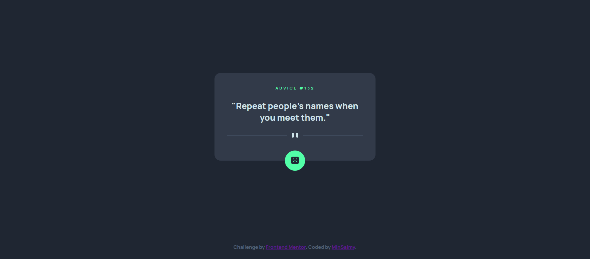

# Frontend Mentor - Advice generator app solution

This is a solution to the [Advice generator app challenge on Frontend Mentor](https://www.frontendmentor.io/challenges/advice-generator-app-QdUG-13db). Frontend Mentor challenges help you improve your coding skills by building realistic projects.

## Table of contents

- [Overview](#overview)
  - [The challenge](#the-challenge)
  - [Screenshot](#screenshot)
  - [Links](#links)
- [My process](#my-process)
  - [Built with](#built-with)
  - [What I learned](#what-i-learned)
  - [Continued development](#continued-development)
  - [Useful resources](#useful-resources)
- [Author](#author)

## Overview

### The challenge

Users should be able to:

- View the optimal layout for the app depending on their device's screen size
- See hover states for all interactive elements on the page
- Generate a new piece of advice by clicking the dice icon

### Screenshot



### Links

- Solution URL: [https://github.com/MinSalmy/advice-generator-app-main](https://github.com/MinSalmy/advice-generator-app-main)
- Live Site URL: [https://minsalmy.github.io/advice-generator-app-main/](https://minsalmy.github.io/advice-generator-app-main/)

## My process

### Built with

- Semantic HTML5 markup
- CSS custom properties
- Flexbox
- CSS Grid
- Mobile adaptive

### What I learned

I learned how to get data throw fetch and XHR

```js
async function sendRequestFetch(url) { 
    const response = await fetch(url);
    if (response.ok) {
        return response.json();
    }
    const error = await response.json();
    const e = new Error('Что-то пошло не так');
    e.data = error;
    throw e;
}
   
sendRequestFetch(adviceURL)
    .then(data => console.log(data))
    .catch(error => console.log(error));

function sendRequestXHR(method, url) {
    return new Promise( (resolve, reject) => {
        const xhr = new XMLHttpRequest();
        
        xhr.open(method, url);
        xhr.responseType = 'json';
        xhr.onload = () => {
            if (xhr.status >= 400) reject(xhr.response)
            else resolve(xhr.response);
        }
            
        xhr.onerror = () => {
            reject(xhr.response);
        }
        xhr.send();
    })  
}

sendRequestXHR('GET', adviceURL)
    .then(data => console.log(data))
    .catch(error => console.log(error));
```

Also remembered how to do layout for different layout through html and css 

```html
<picture>
              <source media="(max-width: 459px)" srcset="images/pattern-divider-mobile.svg">
              <source media="(min-width: 460px)" srcset="images/pattern-divider-desktop.svg">
              
        </picture>
```
```css
@media screen and (max-width: 459px) {
    .card {
        width: 340px;
    }
    
    .container {
        padding: 20px;
        padding-bottom: 70px;
    }
}
```

### Continued development

I want to get deeper knowledge of using promise and 3d API

### Useful resources

- [Video about requests to the server](https://www.youtube.com/watch?v=eKCD9djJQKc&ab_channel=%D0%92%D0%BB%D0%B0%D0%B4%D0%B8%D0%BB%D0%B5%D0%BD%D0%9C%D0%B8%D0%BD%D0%B8%D0%BD) - This helped me to understand how to get my data from API. I really liked this video and will use it to remind myself this info.
- [GitHub resource with example of getting API data](https://github.com/balkoev/10-javascript-vanilla-projects/blob/main/08%20-%20GithubProfiles/js/app.js) - This example helped me to write my own code for get API's data.

## Author

- Website - [MinSalmy](https://github.com/MinSalmy)
- Frontend Mentor - [@minsalmy](https://www.frontendmentor.io/profile/minsalmy)